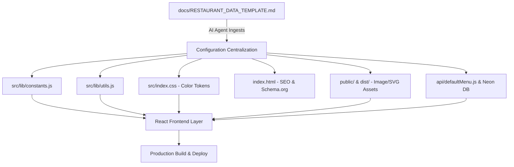

# 🤖 AI AGENT REPLICATION & ADAPTATION GUIDE
> **Project Archetype:** Ultra-Fast, Mobile-First Editorial Restaurant Web Application with WhatsApp Takeaway Cart, Live Timings Engine, Neon PostgreSQL Menu Management, and Geolocation Tagging.
> **Target Audience for this Guide:** Autonomous AI Agents (Claude, Gemini, OpenAI Codex, Antigravity, Cursor, etc.) tasked with replicating this project for a new restaurant using the filled `docs/RESTAURANT_DATA_TEMPLATE.md`.

---

## 0. Overview & Architecture Blueprint

This repository is an optimized Vite + React 19 + Tailwind CSS v4 single-page progressive web application designed for high-conversion restaurant marketing, dynamic digital menu viewing, interactive takeaway order generation via WhatsApp, and live operations tracking.



### Core Architecture Layers:
1. **Presentation Layer (`src/components/`)**:
   - `SplashScreen.jsx`: Animated brand watermark & logo reveal on load (skips when user scrolls/taps or with reduced motion).
   - `Header.jsx`: Sticky backdrop-blur navigation with real-time open/closed status indicator and takeaway bag launcher.
   - `HeroSection.jsx`: Bold editorial headline, brand tagline, 3 elevated signature plates, craft narrative quote, and CTA buttons.
   - `SCurveMenuSection.jsx`: S-wave dual-tone interactive showcase highlighting the 3 flagship dishes with spice levels, dietary badges, and one-tap takeaway add.
   - `MenuBoardSection.jsx`: Full categorised digital menu with price tags, filter courses, instant takeaway cart triggers, and sticky order review pill.
   - `FooterSection.jsx`: Architectural heritage card with live multi-shift status, Google Maps directions, WhatsApp order integration, and catering inquiries.
   - `CartDrawer.jsx`: Slide-over takeaway cart calculating subtotal and auto-generating structured WhatsApp checkout payloads with Google Plus/GPS codes.
   - `MenuEditor.jsx`: In-app `/admin-menu-editor` route for live pricing, availability toggles, category additions, and database synchronization.

2. **State & Utility Layer (`src/lib/` & `src/components/*Context.jsx`)**:
   - `LocationContext.jsx`: Automatically resolves user's GPS coordinates into 7-character Open Location Code (Plus Code) for takeaway pinpointing.
   - `MenuContext.jsx`: Manages reactive menu state, handles Neon PostgreSQL database sync, category registration, local fallback cache, and highlight order.
   - `CartContext.jsx`: Manages reactive takeaway basket state with localStorage persistence.
   - `constants.js`: Central source of truth for restaurant profile, hours, menu defaults, and color mapping.
   - `utils.js`: Timings engine calculating open/break/closed state and WhatsApp message formatter.

---

## 1. Step-by-Step AI Agent Execution Sequence

When tasked to replicate this site for a new restaurant, follow this deterministic 8-step sequence:

### Step 1: Ingest the Restaurant Onboarding Data
1. Read the completed `docs/RESTAURANT_DATA_TEMPLATE.md` (or inspect the provided client dossier/brief).
2. Extract the key data points:
   - Name, Localized script name, Tagline, Punchline, Narrative.
   - Address, Phone, WhatsApp number, Instagram, Google Maps link, GPS coordinates.
   - Timings (Shift 1, Shift 2, Weekly closed day).
   - Color hex codes & font preferences.
   - The 3 Signature dishes + Full menu catalog.

---

### Step 2: Update Core Configuration (`src/lib/constants.js`)

Update `src/lib/constants.js` with the extracted brand parameters:

```javascript
// 1. BRAND DATA
export const BRAND = {
  name: 'RESTAURANT_NAME',               // e.g. 'Little Italy Trattoria'
  nameKannada: 'LOCALIZED_NAME',          // e.g. 'ಲಿಟಲ್ ಇಟಲಿ' or '' (optional)
  tagline: 'BRAND_TAGLINE',              // e.g. 'Wood-Fired Artisanal Pizza & Pasta'
  subtitle: 'BRAND_SUBTITLE',            // e.g. 'Fresh Sourdough • San Marzano • Pure Olive Oil'
  address: 'FULL_ADDRESS_WITH_LANDMARK', // e.g. 'Shop 4, Bella Vista, MG Road, Pune, Maharashtra 411001'
  phone: 'DISPLAY_PHONE',                // e.g. '+91 98220 12345'
  phoneClean: 'CLEAN_PHONE_DIGITS',      // e.g. '919822012345'
  rating: 4.5,                           // e.g. 4.5
  reviewCount: '320+',                   // e.g. '320+'
  mapsLink: 'GOOGLE_MAPS_LINK',          // e.g. 'https://maps.app.goo.gl/...'
  instagram: 'INSTAGRAM_URL',            // e.g. 'https://www.instagram.com/littleitaly'
  whatsappBase: 'https://wa.me/WHATSAPP_PHONE_DIGITS', // e.g. 'https://wa.me/919822012345'
  
  // Editorial Copy
  heroQuote: 'HERO_PUNCHLINE',           // e.g. 'Fermented 48 hours. Baked at 450°C.'
  heroStory: 'HERO_DESCRIPTION',         // e.g. 'Stone-ground organic flour, hand-stretched daily.'
  visitDescription: 'FOOTER_DESCRIPTION',// e.g. 'Cozy trattoria with outdoor patio seating.'
  cateringNote: 'CATERING_NOTE',         // e.g. 'Party orders & pizza catering available.'
}

// 2. OPERATING HOURS (Minutes from midnight)
export const HOURS = {
  morning: { openMin: 720, closeMin: 960, label: 'Lunch Service' },     // 12:00 PM – 4:00 PM (12*60=720, 16*60=960)
  evening: { openMin: 1140, closeMin: 1380, label: 'Dinner Service' },  // 7:00 PM – 11:00 PM (19*60=1140, 23*60=1380)
  holidayDay: 1, // 0=Sunday, 1=Monday, 2=Tuesday, etc. (Set to null if open 7 days)
  holidayLabel: 'Closed on Mondays',
}

// 3. MENU ITEMS
export const MENU_ITEMS = [
  {
    id: 1,
    name: 'Margherita D.O.P',
    subtitle: 'Classic Neapolitan',
    description: 'San Marzano tomato sauce, fresh buffalo mozzarella, fragrant basil & extra virgin olive oil',
    price: 390,
    category: 'Wood-Fired Pizza',
    spiceLevel: 0,
    tags: ['signature', 'bestseller'],
    zone: 'cream',
    image: '/images/margherita.jpg',
    prep: '48-hour slow fermented dough • San Marzano DOP',
  },
  // ... rest of menu items
]
```

---

### Step 3: Configure Theme & Color Tokens (`src/index.css`)

Update the CSS variables in `@theme` in `src/index.css` to match the brand's visual identity:

```css
@theme {
  /* ── Brand Surfaces ── */
  --color-kara: #C83228;         /* Primary Brand Color (Buttons, Hero wrapper, Nav accents) */
  --color-kara-dark: #8F1F18;    /* Primary Brand Dark Hover */
  --color-coconut: #FDFBF7;      /* Clean Page Canvas / Light Background */
  --color-coconut-dark: #F5EFEB; /* Secondary Card Canvas */
  --color-malli: #2B5E34;        /* Botanical / Green Accent */
  --color-ghee: #E5A83B;         /* Warm Gold / Highlight Badges / Price Tags */
  --color-ghee-light: #F4C773;   /* Light Accent on Dark Surfaces */
  --color-kaapi: #1A1615;        /* Deep Charcoal / Text Dark / Footer Canvas */
  --color-temple: #4A1A1E;       /* Deep Accent / Menu Board Canvas */
  
  /* ── Course Card Tints ── */
  --color-sand: #F7F1E8;
  --color-sage: #E9F0EC;
  --color-turmeric: #FEF9EB;
  --color-rose: #FDEEEE;

  /* ── Typography Pairing ── */
  --font-display: 'DM Serif Display', serif; /* Editorial Headings */
  --font-body: 'Plus Jakarta Sans', sans-serif; /* Body & Numbers */
}
```

> **Tip:** If changing fonts, also update the Google Fonts `<link>` tag in `index.html`.

---

### Step 4: Replace Brand Assets & Food Photography

Place all brand assets in the `public/` directory:

1. **Logo & Favicon**:
   - `public/kolam.svg` or `public/logo.svg`: The vector logo used in `Header`, `SplashScreen`, and browser favicon.
   - `public/kolam-cream.svg` & `public/kolam-kara.svg`: Light and dark high-contrast SVGs used for watermarks and corner frames.
   - `public/benne.jpg` or `public/apple-touch-icon.png`: 512x512 square logo icon.
2. **Food Photography (`public/images/`)**:
   - Store square/4:3 high-res images for signature items in `public/images/`.
   - Provide both `.jpg` and `.webp` versions (or generate `.webp` with sharp/imagemagick).
   - E.g., `/images/signature-1.jpg` and `/images/signature-1.webp`.

---

### Step 5: Update SEO, Meta Tags & Schema.org (`index.html`)

Modify `index.html` to inject proper search engine and social preview metadata:

1. Update `<title>`: `[Restaurant Name] | [Tagline] in [City]`
2. Update `<meta name="description">`: Concise 150-char summary of food, location, hours.
3. Update OpenGraph tags (`og:title`, `og:description`, `og:image`, `og:url`).
4. Update `<script type="application/ld+json">` with Schema.org `Restaurant` object:
   - `name`: Brand name
   - `servesCuisine`: Cuisine array (e.g. `["Italian", "Pizza", "Pasta"]`)
   - `telephone`: Clean phone number
   - `address`: Detailed `PostalAddress` object
   - `aggregateRating`: Rating score and count
   - `openingHoursSpecification`: Daily operating windows

---

### Step 6: Sync Database & API Seeds (`api/defaultMenu.js`)

1. Copy the `MENU_ITEMS` array into `api/defaultMenu.js` with `isHighlight` and `highlightOrder` configured:
   - Dish 1: `isHighlight: true, highlightOrder: 1` (Left flank)
   - Dish 2: `isHighlight: true, highlightOrder: 2` (Center hero plate)
   - Dish 3: `isHighlight: true, highlightOrder: 3` (Right flank)
2. If Neon PostgreSQL is used:
   - Set `DATABASE_URL` in `.env` (or Vercel / server environment variables).
   - Send `POST /api/init-db` with body `{"force": true}` to automatically create the table and seed all items.
3. If no database is configured:
   - The application automatically runs in local-fallback mode using `localStorage` and `constants.js` with zero errors!

---

### Step 7: Verify WhatsApp Takeaway Engine (`src/lib/utils.js`)

Verify `buildWhatsAppUrl` in `src/lib/utils.js`:
- Ensures the message header shows `*[RESTAURANT_NAME] - Order Details*`.
- Ensures itemized quantity formatting `* _[Dish Name]_ - [Quantity]`.
- Ensures customer name, phone, and geolocation link are attached.
- Verifies `buildQuickOrderWhatsAppUrl` formats the quick takeaway greeting correctly.

---

### Step 8: Build, Smoke Test & Validate

Run the validation suite:

```bash
# 1. Install dependencies
npm install

# 2. Run local development server
npm run dev

# 3. Build production bundle (checks JSX, Tailwind v4 compilation & Vite bundling)
npm run build

# 4. Preview production build
npm run preview
```

#### Manual Quality Checklist:
- [ ] **Splash Screen**: Brand logo animates cleanly and disappears after 2.2s.
- [ ] **Hero Section**: 3 signature plates render crisp images (or elegant fallback title plates).
- [ ] **Status Pill**: Displays correct "Open Now", "Reopens at X:XX", or "Closed Today" based on local time.
- [ ] **S-Curve Section**: Wave boundary splits cleanly, Add buttons trigger cart increments.
- [ ] **Menu Board**: All categories render with correct prices in rupees (`₹`).
- [ ] **Cart Drawer**: Items accumulate correctly; "Send order on WhatsApp" opens `wa.me` with pre-filled items, totals, and location.
- [ ] **Admin Menu Editor**: Navigating to `/#admin-menu-editor` allows editing prices, toggling availability, and creating categories.

---

## 2. Common Edge Cases & Troubleshooting

| Scenario | Solution |
| :--- | :--- |
| **Restaurant is open continuously (no afternoon break)** | In `constants.js`, set `HOURS.morning.openMin` (e.g. 660 = 11am) and `HOURS.morning.closeMin` to end of day (e.g. 1380 = 11pm). Set `HOURS.evening` to null or identical. |
| **Restaurant is open 7 days a week (no holiday)** | Set `HOURS.holidayDay = null` or `-1`. |
| **Non-Vegetarian / Mixed Restaurant** | In `src/components/DishMeta.jsx`, update `VegMark` to support non-veg/halal badges, or pass `item.isVeg` dynamically per dish. |
| **No Kannada / Regional subtitle for dishes** | In `src/lib/constants.js`, set `subtitle: ''` or use it for English descriptions like `"Thin Crust"`. The layout gracefully collapses empty subtitles. |
| **No dish photography available** | Dishes without `image: ''` automatically render high-editorial display typography plates (`PlateMark`) with warm background tints—no broken image icons! |
| **Custom Currency (e.g. $, €, £, AED)** | In `src/lib/utils.js`, change `formatPrice(n)` to return `${symbol}${n}` or `${n} AED`. |
