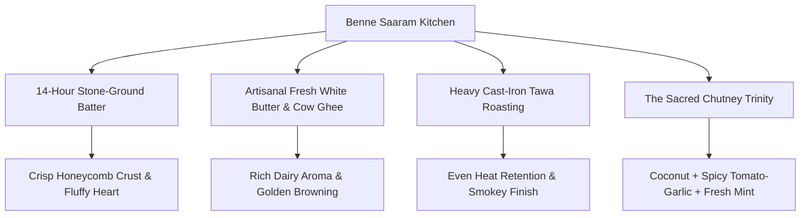

Used tool: search_web
Used tool: search_web
Used tool: search_web
Used tool: search_web

# 🍛 BENNE SAARAM (बेण्णे सारम्) — BRAND BIBLE & COMPREHENSIVE DOSSIER
*Authentic South Indian Flavours • Davangere Benne Dosa • Degree Filter Kaapi*
**Location:** Cycle Circle, College Road / Parijat Nagar, Nashik, Maharashtra

---

## 1. Executive Brand Summary

| Attribute | Details |
| :--- | :--- |
| **Brand Name** | **Benne Saaram** (Kannada / Sanskrit roots: *ಬೆಣ್ಣೆ ಸಾರಂ* / *बेण्णे सारम्*) |
| **Culinary Archetype** | Authentic Karnataka (Davangere / Bengaluru) Quick-Service Breakfast & Tawa Kitchen |
| **Flagship Offerings** | Davangere Benne Dosa, Garlic Roast Masala Dosa, Ghee Podi Thatte Idli, Doodh Bun Maska, Degree Filter Coffee |
| **Primary Location** | Shop No. 1, Pandit Park-2, Near Cycle Circle, Krushi Nagar Jogging Track, Samartha Nagar / Parijat Nagar, College Road, Nashik – 422005 |
| **Google Maps Coordinates** | `2Q35+82X, Nashik` • [Google Maps Link](https://maps.app.goo.gl/ihJwnuPz2DZmVrZG6) |
| **Operating Hours** | **Morning Shift:** 8:00 AM – 3:00 PM<br>**Evening Shift:** 6:00 PM – 10:00 PM<br>**Weekly Holiday:** Closed on Tuesdays |
| **Direct Contact** | `+91 98902 04569` |
| **Social Presence** | Instagram: [`@bennesaaramofficial`](https://www.instagram.com/bennesaaramofficial) |
| **Rating & Standing** | ⭐ **4.2 / 5.0** (175+ Verified Google Reviews) |
| **Price Point** | ₹200 – ₹400 for two (High value-to-taste ratio) |
| **Target Audience** | Morning joggers & cyclists from Krushi Nagar track, College Road students, families, South Indian culinary purists |

---

## 2. Etymology, Roots & Brand Narrative

```
   ┌──────────────────────────────────────────────────────────────┐
   │  "BENNE" (ಬೆಣ್ಣೆ)    = Pure, freshly churned white butter    │
   │  "SAARAM" (ಸಾರಂ)   = The essence, core soul & rich flavour   │
   └──────────────────────────────────────────────────────────────┘
```

### The Culinary Heritage of Davangere
Unlike generic thin dosas, the **Davangere Benne Dosa** is a culinary legend from central Karnataka, crafted from a unique rice-and-flattened-paddy (*poha*) batter that ferments slowly for 14 hours. It is roasted on ultra-thick cast iron griddles (*tawa*) basted with generous dollops of artisanal, unsalted white butter (*benne*). The result is a textural masterpiece: **a crisp, caramelised golden-brown crust with an extraordinarily soft, honeycomb, cloud-like interior.**

### The Nashik Story
Benne Saaram was founded to bridge the gap between North Maharashtra and the sacred breakfast lanes of Bengaluru’s VV Puram and Davangere. Positioned strategically by the **Krushi Nagar Jogging Track & Cycle Circle**, it has rapidly become Nashik's morning ritual hub for athletes, students, and food connoisseurs seeking pure cow ghee, unadulterated white butter, and freshly decocted chicory filter coffee.

---

## 3. Brand Identity & Visual Design System

The visual identity embodies **Neo-Dakshin Minimalism**—a synthesis of classical Dravidian iconography and contemporary editorial restraint.

```
                  [ THE CHUTNEY TRIO COLOR SYSTEM ]
  ┌──────────────────────────────────────────────────────────────────┐
  │  🔴 Kara Ruby Red       (#991D22)  Inspired by spicy Kara Chutney│
  │  🥥 Thengai Champagne   (#FAF5ED)  Inspired by Fresh Coconut Chutney│
  │  🍃 Malli Forest Green  (#183D1D)  Inspired by Banana Leaf & Mint │
  │  🧈 Ghee Gold           (#D49B35)  Inspired by Cast-Iron Ghee Roast│
  │  ☕ Kaapi Charcoal      (#1F1A17)  Inspired by Chicory Coffee Roast│
  └──────────────────────────────────────────────────────────────────┘
```

### The Sacred Emblem (Sikku Kolam Yantra)
* **The Logo Motif**: An authentic geometric **Sikku Kolam** (interlocking continuous loop pattern surrounding a sacred matrix of dots). 
* **Symbolism**: In South Indian tradition, the threshold Kolam welcomes prosperity, signifies purity, and represents the eternal, unbroken cycle of hospitality (*Athithi Devo Bhava*).
* **Graphic Application**: Used as an ethereal rotating watermark at 6–8% opacity in digital hero backdrops, debossed on kraft takeaway packaging, and utilized as fine-line corner knots for ethnic framed borders.

### Typography Hierarchy
* **Display / Editorial Headings**: `DM Serif Display` / `Rozha One` — Expressive, high-contrast, Indian royal heritage feel.
* **Body & Numerical Interface**: `Plus Jakarta Sans` / `Inter` — Crisp, modern, legible, optimized for mobile thumb navigation and price readability (`₹`).

---

## 4. Culinary Pillars & Menu Architecture



### The Signature "Pancha-Ratna" (5 House Legends)

#### 1. Davangere Classic Benne Dosa
* **The Experience**: Thick, bubbly fermented batter roasted on hot cast iron with pure white butter. Served folded over mild spiced potato sagu and a dollop of cold melting benne on top.
* **Texture Profile**: Crunchy golden exterior, melt-in-mouth spongy interior.

#### 2. Benne Garlic Roast Masala Dosa
* **The Experience**: The kitchen's standout star in customer reviews. The inner tawa face is generously slathered with a fiery, slow-cooked red garlic-chili paste before being roasted to a mahogany crisp.
* **Review Consensus**: Rated "best in Nashik for bold garlic lovers".

#### 3. Ghee Podi Thatte Idli
* **The Experience**: Plate-sized, thick Karnataka-style steamed idli, pierced and lavishly bathed in hot liquefied cow ghee, then encrusted with roasted lentil-chili gun powder (*milagai podi*).

#### 4. Ghee Button Idlis in Sambar Katori
* **The Experience**: Twelve bite-sized, feather-light button idlis completely submerged in piping hot, lentil-rich Udupi sambar with fresh curry leaf tempering.

#### 5. Kumbakonam Degree Filter Kaapi
* **The Experience**: Dark-roasted Arabica/Robusta beans infused with 15% chicory, brewed in a gravity drip brass filter, frothed with boiled whole milk, and served steaming in traditional brass *Davarah & Tumbler*.

### Morning Walking & Evening Specials
* **Doodh Bun Maska**: Pillowy soft milk buns sliced and stuffed with thick churned butter, ideal for dipping into hot filter coffee.
* **Crisp Medu Vada**: Ultra-crunchy outer shell with whole black pepper and fresh ginger bits.
* **Podi Tossed Vada**: Crispy vada tossed in spiced podi butter.

---

## 5. Operations, Seating & Location Dynamics

```
                  [ DAILY OPERATING RHYTHM ]
  ┌─────────────────────────────────────────────────────────────┐
  │  08:00 AM ─── 03:00 PM  → Morning Batch (Breakfast & Lunch)│
  │  03:00 PM ─── 06:00 PM  → Afternoon Prep & Batter Rest     │
  │  06:00 PM ─── 10:00 PM  → Evening Batch (Tawa Specials)     │
  │  TUESDAY                → Kitchen Holiday / Deep Clean     │
  └─────────────────────────────────────────────────────────────┘
```

### Food-First QSR Reality & Strategy
* **The Trade-Off**: Benne Saaram is an authentic, taste-first quick service spot with limited indoor seating. During peak morning hours (**8:30 AM – 10:30 AM**), indoor seating fills up rapidly.
* **The Solution**: 
  1. Rapid **Takeaway Counter** with custom steam-release ventilated packaging to keep dosas crisp.
  2. Outdoor **Standing Counters** where morning joggers enjoy quick idli-kaapi pairings.
  3. Pre-order pickup via WhatsApp to bypass queue delays.

---

## 6. Verified Customer Review Sentiment

Based on Google Reviews and local Nashik food critiques:

```
 Food Quality & Taste   ★★★★★★★★★★  95% (Legendary butter crispiness)
 Authenticity of Kaapi  ★★★★★★★★★☆  90% (True South Indian decoction)
 Service Speed          ★★★★★★★★☆☆  82% (Fast during normal hours)
 Seating / Ambience     ★★★★★★☆☆☆☆  68% (Cozy, high rush on weekends)
 Value for Money        ★★★★★★★★★☆  92% (Premium ingredients at honest prices)
```

> **Review Highlights:**
> * *"The Garlic Roast Masala Dosa has that exact Bengaluru CTR / Davangere crispiness that Nashik was missing."*
> * *"Thatte Idli with Ghee Podi melts in your mouth. Best filter coffee near College Road."*
> * *"Small place, high rush, but the taste makes you forget everything."*

---

## 7. Digital Product & Frontend Website Flow

The frontend website delivers an Indian ethnic, editorial experience across 4 stages:

```
┌────────────────────────────────────────────────────────────────────────────┐
│ STAGE 1: THE "PLATELY"-STYLE COVER & ROTATING KOLAM YANTRA                 │
│ • Hypnotic rotating Sikku Kolam (from logo) at 8% opacity in background    │
│ • Large bold retro-ethnic serif headline: "Benne Saaram."                  │
│ • 3 overhead top-down food plates horizontally aligned with drop shadows   │
├────────────────────────────────────────────────────────────────────────────┤
│ STAGE 2: THE S-CURVE DUAL-TONE SPLIT MENU                                  │
│ • Organic S-wave dividing Kara Ruby Red (#991D22) & Coconut Cream (#FAF5ED)│
│ • Cutout bold editorial headline "MENU"                                    │
│ • Dish plates straddling the curve boundary with deep culinary descriptions│
├────────────────────────────────────────────────────────────────────────────┤
│ STAGE 3: THE ORGANIC BENTO & PASTEL PATRIKA                                │
│ • Earthy sand & sage canvas with organic arched frames                     │
│ • Chutney-tinted bento cards with spice meters, ratings & WhatsApp add     │
│ • Floating Takeaway Cart generating itemized WhatsApp messages             │
├────────────────────────────────────────────────────────────────────────────┤
│ STAGE 4: FULL-SCREEN HERITAGE DAKSHIN FOOTER                               │
│ • Deep Temple Maroon canvas with corner Kolam knot frames                  │
│ • Live Hours Tracker, Cycle Circle GPS Route & Catering Form               │
│ • Sticky Mobile Bottom Action Bar (Call • Map • Menu • WhatsApp)           │
└────────────────────────────────────────────────────────────────────────────┘
```

---

## 8. Summary Checklist for Implementation

- [x] **Brand Assets**: Logo vector extracted from `benne.jpg` with Sikku Kolam pattern.
- [x] **Verified Address**: Near Cycle Circle, Krushi Nagar Jogging Track, College Road / Samartha Nagar, Nashik.
- [x] **Verified Phone**: `070570 53534` (Direct call & WhatsApp API ready).
- [x] **Timings Engine**: Configured for 8 AM–3 PM & 6 PM–10 PM (Tuesday closed).
- [x] **Design Tokens**: Kara Red, Coconut Ivory, Forest Green, Ghee Gold, Kaapi Charcoal.
- [x] **Interaction**: Continuous rotating background Kolam, S-curve scroll triggers, and WhatsApp takeaway cart builder.